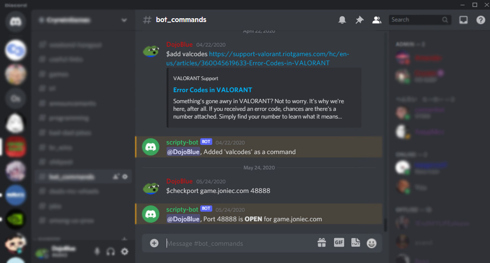
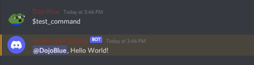

# :robot:basic_bot
A NodeJS discord bot that does what you need while allowing for your custom JS scripts.



## Setup
1. Clone the repo, run `npm install` to get dependencies
2. run `npm run start`, this will create necessary json files
3. Edit **data.json** and replace TOKEN_HERE with your [discord bot token](https://www.writebots.com/discord-bot-token/#:~:text=A%20Discord%20Bot%20Token%20is,generate%20a%20Discord%20Bot%20Token.)
4. From here your bot should be ready to use! Run `npm run start`

## Usage
Commands must always start with $

### Default Commands
**$help** - lists available commands.<br />
**$help <command_name>** - lists help message for command.<br />
**$add <command_name> <reply...>** - adds new command. <br />
**$set <command_name> <reply...>** - overrwrites existing command reply <br />
**$del <command>** - deletes command
**$<custom_command>** - runs custom command.<br />
**$restart** - restarts bot <br />
**$sethelp** - sets help message for a custom command.<br />

### :clipboard:Scripts (advanced)
You can have commands that run your very own JS scripts. All scripts are stores within **/scripts** as .js files. To greet users with a random greeting, we can add the **random_greeting.js** script in **data.json**:

See the [random greeting script](https://github.com/duecknoah/basic_bot/blob/master/scripts/random_greeting.js)

```
{
  ...
  "commands": {
    "greetme": {
      "name": "greetme",
      "script": "random_greeting.js"
    }
  },
  ...
}
```

To aid users, you can link it to the help function which will return your help_msg string:
```
"greetme": {
  "name": "greetme",
  "script": "random_greeting.js",
  "help_msg": "Responds to you with a random greeting :)"
}
```
If the user types `help greetme` <br />
the bot will run the script and reply with something like  `@user123, Nice meeting you!`


Normal commands without scripts will look something like this:

```
"test_command": {
  "name": "test_command",
  "response": "Hello World!",
  "help_msg": "this is a command used for testing."
}
```

